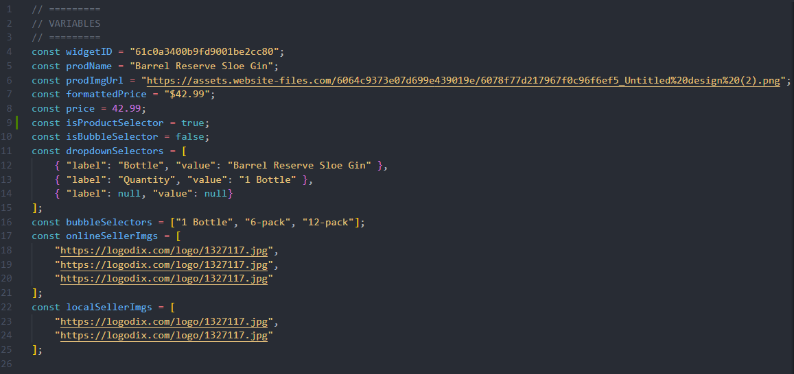
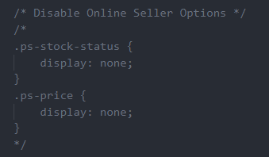

# PriceSpider Proofing Templates

## Index:
- [Description](#description)
- [Instructions](#instructions)
- [Troubleshooting](#troubleshooting)

## Available templates:
[Product Lightbox](https://github.com/ps-jkelly/ps-proof-templates/tree/main/ProductLightbox) 

---

## Description
This repo is a work in progress. Solutions Developers can collaborate here to create templates that can be uploaded to a WTB widget created in Timberlake to improve its use as a proofing tool. These templates will need to be created and updated to account for ongoing changes to the Timberlake tool. The purpose of these templates is to speed up the process of creating proofs in Timberlake without having to extensively rely on editting the widget in the browser or the use of graphic design applications. Another benefit is that you can now save your proofs in case you need to go back and edit them. This method allows you to declare your assets and styles upfront in the *script.js* and *override.scc* files and then watch the widget build itself in Timberlake.

## Instructions

### Copy to your computer
1. Clone the repository to your computer.
2. In your client's folder on your computer, create a folder called *proof-productLightbox* (Or whatever type of WTB you're building).
3. Copy over the *script.js* and *override.js* files into that folder from the correct template. (at the moment, there is only the ProductLightbox template)

### The script.js file
4. Open the *script.js* file and edit the variables to include the assets you want to appear on the screen. 
    - Change the **widgetID** to match the widget you're working on.
    - Change **prodName** and **prodImgUrl** to match a product of your choice.
    - The variables **price** and **formattedPrice** change the price displayed for online retailers.
    - If you're using product selectors, set **isProductSelector** to **true**. If you plan to use bubble selectors, set **isBubbleSelector** to **true**. Change the values of the **dropdownSelectors/bubbleSelectors** to whatever you want to display.
    - Change the array values for **onlineSellerImgs** and **localSellerImgs** to be the URLs for the retailers you wish to display. Or you can make these arrays empty and the default sellers will appear. For online, the default sellers are Amazon, Walmart, and Target. For local, the default sellers will be whatever our crawler picked up for the test sku that you input into the widget.

    

### The override.css file
5. Change the variables to apply the color and border styles you wish to see in the widget. Feel free to make any other changes to the file that you deem necessary for your proof.

    

6. If you wish to disable "stock status" or "price" then this is where you do it. Simply un-comment the code at the bottom of the file.

    

### Implement on Timberlake
7. Log into *Prospective Demo* on Insights.
8. Log into Timberlake and select *Templates* from the "Select a Brand" dropdown.
9. Select the widget type and then widget you want to make. (for now, select only *Stadard (Product)* > *Product Lightbox*)
10. Click on the variant that you use for creating proofs, or create one if you don't already have one. (for a working example, click on **jk-demo**)
11. Toggle on *Brand Logo*, *Product Selector*, and *Product Selector Label* if using. Then click Build > Save.
12. Go to the **Asset Manager** and upload your *script.js* and *override.css* files. Also upload a logo and font if you're using them.
13. Go back to your widget editor and click Build. You should now see your assets and styles appear in the lightbox. Below you can see an example of this in action.

    

## Troubleshooting
- Simply closing the lightbox and then re-opening it seems to fix most issues.
- Make sure that `"loadScript"=true` is in the advanced json for the widget.